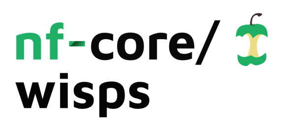

<h1>
  <picture>
    <source media="(prefers-color-scheme: dark)" srcset="docs/images/nf-core-wisps_logo_dark.png">
    
  </picture>
</h1>

[](https://github.com/nf-core/wisps/actions/workflows/ci.yml)
[](https://github.com/nf-core/wisps/actions/workflows/linting.yml)[](https://nf-co.re/wisps/results)[](https://doi.org/10.5281/zenodo.XXXXXXX)
[](https://www.nf-test.com)

[](https://www.nextflow.io/)
[](https://docs.conda.io/en/latest/)
[](https://www.docker.com/)
[](https://sylabs.io/docs/)
[](https://cloud.seqera.io/launch?pipeline=https://github.com/nf-core/wisps)

[](https://nfcore.slack.com/channels/wisps)[](https://twitter.com/nf_core)[](https://mstdn.science/@nf_core)[](https://www.youtube.com/c/nf-core)

## Introduction

**nf-core/wisps** is a bioinformatics pipeline for interaction screening by structure prediction. It ingests a samplesheet of sequence entries (FASTA format) and generates interaction sets based on all-vs-all or group-based modes. The workflow then runs MSA/search and structure prediction with supported models (Boltz, ColabFold, and/or AlphaFold3), computes confidence/interface metrics (including IPSAE), and produces per-interaction result files alongside run-level reports such as MultiQC.

<!-- TODO nf-core: Include a figure that guides the user through the major workflow steps. Many nf-core
     workflows use the "tube map" design for that. See https://nf-co.re/docs/contributing/design_guidelines#examples for examples.   -->
- Validate and parse sequence inputs from the samplesheet (FASTA).
- Build interaction sets in manual, all-vs-all or group-based screening mode.
- Generated paired MSAs for each interaction using ColabFold Search powered by MMSeqs2.
- Run structure prediction for each interaction with the configured model(s) (Boltz, ColabFold, and/or AlphaFold3).
- Compute confidence and interface metrics, including IPSAE.
- Aggregate run metrics and QC summaries in [`MultiQC`](http://multiqc.info/).

## Usage

> [!NOTE]
> If you are new to Nextflow and nf-core, please refer to [this page](https://nf-co.re/docs/usage/installation) on how to set-up Nextflow. Make sure to [test your setup](https://nf-co.re/docs/usage/introduction#how-to-run-a-pipeline) with `-profile test` before running the workflow on actual data.

Before running the pipeline, several resources must be available on the computing infrastructure:
- **All** tools require the ColabFold MMSeqs2 databases which can be set up following the instructions available [here](https://github.com/sokrypton/ColabFold/tree/main?tab=readme-ov-file#generating-msas-for-large-scale-structurecomplex-predictions)
- **ColabFold** requires AlphaFold2 model parameters available from the download [link](https://storage.googleapis.com/alphafold/alphafold_params_2022-12-06.tar).
- **Boltz** requires model parameters for the Boltz-2 structure prediction model ([link](https://huggingface.co/boltz-community/boltz-2/resolve/main/boltz2_conf.ckpt)), affinity prediction model ([link](https://huggingface.co/boltz-community/boltz-2/resolve/main/boltz2_aff.ckpt)) and CCD files ([link](https://huggingface.co/boltz-community/boltz-2/resolve/main/mols.tar))
- **AlphaFold3** requires model parameters which must be requested from Google Deepmind.

> [!WARNING]
> Users must obtain the AlphaFold3 weights directly from DeepMind according to their [terms of use](https://github.com/google-deepmind/alphafold3/blob/main/WEIGHTS_TERMS_OF_USE.md) and [prohibited use policy](https://github.com/google-deepmind/alphafold3/blob/main/WEIGHTS_PROHIBITED_USE_POLICY.md). Please ensure you comply with all terms and conditions before using AlphaFold3. For more information about AlphaFold3 usage and requirements, please refer to the [official AlphaFold3 repository](https://github.com/google-deepmind/alphafold3).

The location of individual resources can be set using an infrastructure configuration file. As an alternative, resources can be set up with the following file structure:

```bash
WISPS-DB/
├── colabfold_envdb/
├── colabfold_uniref30/
└── params
    ├── af3.bin
    ├── alphafold_params_2022-12-06/
    ├── boltz2_aff.ckpt
    ├── boltz2_conf.ckpt
    └── mols/
```

Using this structure, resources can be found by assigning `--db <PATH/TO/WISPS-DB>`

To run the pipeline with the minimum required inputs:

1. Create a samplesheet CSV with at least `id` and `sequence` columns (`type` and `group` are optional).
2. Put one sequence entry per row; `sequence` must point to a `.fasta` file. Each fasta file may contain multiple entities which will be considered as a single unit when building candidate interactions.
3. Run `nextflow run` with `--input`, `--outdir`, and a compute `-profile`.

`samplesheet.csv`:

```csv
id,sequence,type,group
S1,./data/S1.fasta,protein,A
S2,./data/S2.fasta,protein,B
S3,./data/S3.fasta,rna,A
```

In this file, each row represents a single unit (can contain multiple sequences) to be used to generate candidate interactions.

Now, to model molecules in group A partnered with molecules in group B you can run the pipeline using:

```bash
nextflow run Australian-Structural-Biology-Computing/wisps \
   --input ./samplesheet.csv \
   --outdir ./results \
   --db WISPS-DB \
   --mode A-B \
   -profile docker
```

> [!WARNING]
> Please provide pipeline parameters via the CLI or Nextflow `-params-file` option. Custom config files including those provided by the `-c` Nextflow option can be used to provide any configuration _**except for parameters**_; see [docs](https://nf-co.re/docs/usage/getting_started/configuration#custom-configuration-files).

For more details and further functionality, please refer to the [usage documentation](https://nf-co.re/wisps/usage) and the [parameter documentation](https://nf-co.re/wisps/parameters).

## Pipeline output

To see the results of an example test run with a full size dataset refer to the [results](https://nf-co.re/wisps/results) tab on the nf-core website pipeline page.
For more details about the output files and reports, please refer to the
[output documentation](https://nf-co.re/wisps/output).

## Credits

nf-core/wisps was originally written by Ziad Al-Bkhetan and Thomas Liftin.

We thank the following people for their extensive assistance in the development of this pipeline:

<!-- TODO nf-core: If applicable, make list of people who have also contributed -->

## Contributions and Support

If you would like to contribute to this pipeline, please see the [contributing guidelines](.github/CONTRIBUTING.md).

For further information or help, don't hesitate to get in touch on the [Slack `#wisps` channel](https://nfcore.slack.com/channels/wisps) (you can join with [this invite](https://nf-co.re/join/slack)).

## Citations
