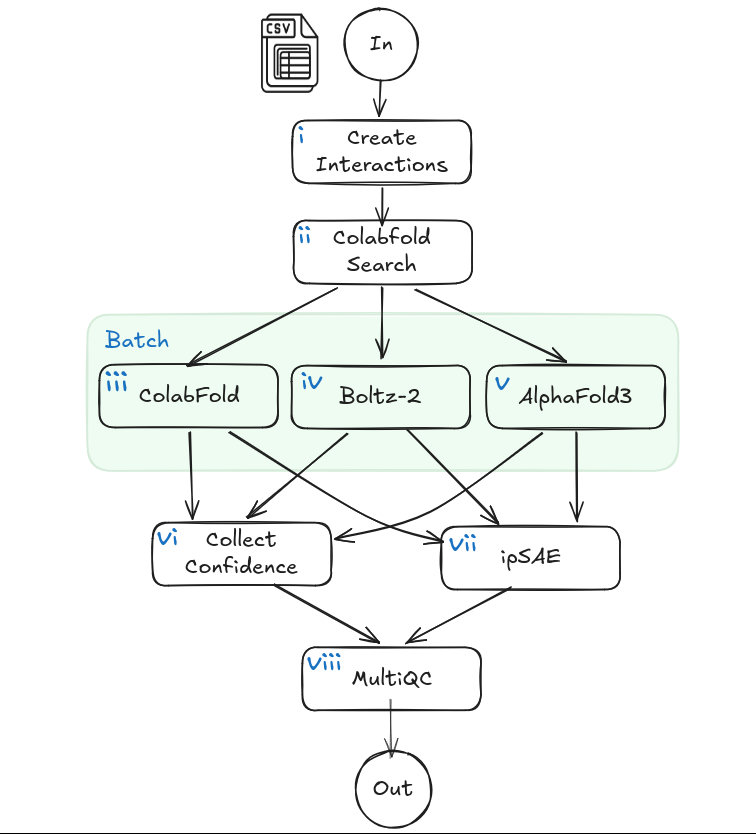

# wisps: *w*orkflow for *i*nteraction *s*creening by *p*redicting *s*tructures

## Introduction

**Australian-Structural-Biology-Computing/wisps** is a bioinformatics pipeline for interaction screening by structure prediction. It ingests a samplesheet of sequence entries (FASTA format) and generates interaction sets based on all-vs-all or group-based modes. The workflow then runs MSA/search and structure prediction with supported models (Boltz, ColabFold, and/or AlphaFold3), computes confidence/interface metrics (including IPSAE), and produces per-interaction result files alongside run-level reports such as MultiQC.

- Validate and parse sequence inputs from the samplesheet (FASTA).
- Build interaction sets in manual, all-vs-all or group-based screening mode.
- Generated paired MSAs for each interaction using ColabFold Search powered by MMSeqs2.
- Run structure prediction for each interaction with the configured model(s) (Boltz, ColabFold, and/or AlphaFold3).
- Compute confidence and interface metrics, including IPSAE.
- Aggregate run metrics and QC summaries in [`MultiQC`](http://multiqc.info/).



## Usage

> [!NOTE]
> If you are new to Nextflow, please familiarise yourself with nextflow before running the workflow on actual data.

Before running the pipeline, several resources must be available on the computing infrastructure:

- **All** tools require the ColabFold MMSeqs2 databases which can be set up following the instructions available [here](https://github.com/sokrypton/ColabFold/tree/main?tab=readme-ov-file#generating-msas-for-large-scale-structurecomplex-predictions)
- **ColabFold** requires AlphaFold2 model parameters available from the download [link](https://storage.googleapis.com/alphafold/alphafold_params_2022-12-06.tar).
- **Boltz** requires model parameters for the Boltz-2 structure prediction model ([link](https://huggingface.co/boltz-community/boltz-2/resolve/main/boltz2_conf.ckpt)), affinity prediction model ([link](https://huggingface.co/boltz-community/boltz-2/resolve/main/boltz2_aff.ckpt)) and CCD files ([link](https://huggingface.co/boltz-community/boltz-2/resolve/main/mols.tar))
- **AlphaFold3** requires model parameters which must be requested from Google Deepmind.

> [!WARNING]
> Users must obtain the AlphaFold3 weights directly from DeepMind according to their [terms of use](https://github.com/google-deepmind/alphafold3/blob/main/WEIGHTS_TERMS_OF_USE.md) and [prohibited use policy](https://github.com/google-deepmind/alphafold3/blob/main/WEIGHTS_PROHIBITED_USE_POLICY.md). Please ensure you comply with all terms and conditions before using AlphaFold3. For more information about AlphaFold3 usage and requirements, please refer to the [official AlphaFold3 repository](https://github.com/google-deepmind/alphafold3).

The location of individual resources can be set using an infrastructure configuration file. As an alternative, resources can be set up with the following file structure:

```bash
WISPS-DB/
├── colabfold_envdb/
├── colabfold_uniref30/
└── params
    ├── af3.bin
    ├── alphafold_params_2022-12-06/
    ├── boltz2_aff.ckpt
    ├── boltz2_conf.ckpt
    └── mols/
```

Using this structure, resources can be found by assigning `--db <PATH/TO/WISPS-DB>`

To run the pipeline with the minimum required inputs:

1. Create a samplesheet CSV with at least `id` and `sequence` columns (`type` and `group` are optional).
2. Put one sequence entry per row; `sequence` must point to a `.fasta` file. Each fasta file may contain multiple entities which will be considered as a single unit when building candidate interactions.
3. Run `nextflow run` with `--input`, `--outdir`, and a compute `-profile`.

`samplesheet.csv`:

```csv
id,sequence,type,group
S1,./data/S1.fasta,protein,A
S2,./data/S2.fasta,protein,B
S3,./data/S3.fasta,rna,A
```

In this file, each row represents a single unit (can contain multiple sequences) to be used to generate candidate interactions.

Now, to model molecules in group A partnered with molecules in group B you can run the pipeline using:

```bash
nextflow run Australian-Structural-Biology-Computing/wisps \
   --input ./samplesheet.csv \
   --outdir ./results \
   --db WISPS-DB \
   --mode A-B \
   -profile docker
```

> [!WARNING]
> Please provide pipeline parameters via the CLI or Nextflow `-params-file` option. Custom config files, including those provided by the `-c` Nextflow option can be used to provide any configuration _**except for parameters**_.

For more details, further functionalities, and pipeline parameters, please refer to the [usage documentation](docs/usage.md).

## Pipeline output

For more details about the output files and reports, please refer to the
[output documentation](docs/output.md).

## Credits

Australian-Structural-Biology-Computing/wisps was originally written by [Ziad Al-Bkhetan](https://github.com/ziadbkh) and [Thomas Litfin](https://github.com/tlitfin/).

We thank the following people for their extensive assistance in the development of this pipeline:

## Contributions and Support

If you would like to contribute to this pipeline or for further information/help please reach out to us.

## Citations
